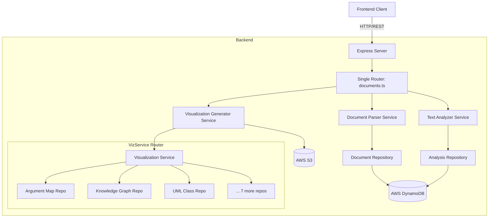

# Backend Server Architecture

**Date:** January 7, 2026
**Status:** Current Implementation

## 1. Overview

The Vaisu backend is a **Node.js** application built with **Express.js** and **TypeScript**. It follows a **hybrid layered architecture** with a focus on LLM integration, AWS services, and visualization generation.

The system is responsible for document processing, semantic analysis (via LLMs), and generating structured data for advanced frontend visualizations (Knowledge Graphs, Argument Maps, etc.).

## 2. Architectural Pattern

The application adheres to a modified layered architecture:

- **Presentation Layer**: Single monolithic route file (`documents.ts`) handling all HTTP requests
- **Business Logic Layer**: Two main services - Document Parser and Visualization Generator
- **Data Access Layer**: Repository pattern with 10 specialized DynamoDB tables
- **Shared Domain**: TypeScript interfaces in `shared/src/types.ts`

### High-Level Diagram



## 3. Directory Structure (Actual)

The `backend/src` directory is organized as follows:

```
backend/src/
├── server.ts                    # Entry point, Express setup, middleware
├── routes/
│   └── documents.ts             # SINGLE monolithic router (21 routes)
├── services/
│   ├── documentParser.ts        # PDF/TXT parsing (213 lines)
│   ├── analysis/
│   │   └── textAnalyzer.ts      # ONLY analysis service (746 lines)
│   ├── visualization/
│   │   └── visualizationGenerator.ts  # ONE class, many methods (742 lines)
│   └── storage/
│       └── s3Storage.ts         # S3 upload/download operations
├── repositories/
│   ├── analysisRepository.ts    # Handles 6 visualization types
│   ├── knowledgeGraphRepository.ts
│   ├── argumentMapRepository.ts
│   ├── umlClassRepository.ts    # Handles 3 UML types
│   ├── mindMapRepository.ts
│   ├── flowchartRepository.ts
│   ├── executiveDashboardRepository.ts
│   ├── timelineRepository.ts
│   ├── depthGraphRepository.ts
│   ├── visualizationService.ts  # Aggregator/Router
│   └── types.ts                 # Repository-level types
├── config/
│   ├── aws.ts                   # DynamoDB/S3 client config
│   └── modelConfig.ts           # LLM model configurations
├── utils/
│   └── hash.ts                  # Content hashing
└── scripts/
    ├── setupTables.ts           # DynamoDB table creation
    └── deleteTable.ts           # Cleanup utility
```

### Key Observations vs Documentation

**What Changed from Docs:**
1. ❌ No `/services/analysis/` directory - single `textAnalyzer.ts` file
2. ❌ No `/services/visualization/` directory - single `visualizationGenerator.ts` file
3. ❌ No `/services/storage/` directory - single `s3Storage.ts` file
4. ✅ Single monolithic `documents.ts` router (not split into multiple routes)
5. ✅ `visualizationService.ts` acts as aggregator router
6. ✅ AnalysisRepository handles multiple visualization types (shared responsibility)

## 4. Core Components & Data Flow

### 4.1. Document Upload & Analysis Pipeline (`POST /api/documents/analyze`)

This is the most complex endpoint, combining upload, deduplication, and analysis:

```typescript
// Flow in documents.ts analyze route:
1. Parse input (file or text) → Document object
2. Calculate content hash
3. Check DynamoDB cache (deduplication)
4. If cache HIT:
   - Return existing document + analysis
   - Update access metadata
5. If cache MISS:
   - Call textAnalyzer.analyzeDocument()
   - Generate analysis with LLM (OpenRouter)
   - Store in S3 + DynamoDB
   - Return new document + analysis
```

**Key Features:**
- **Progress Tracking**: Real-time updates via `progressStore` (memory-only)
- **In-Memory Caching**: Documents cached in `Map<string, Document>`
- **Fallback Strategy**: Continues even if storage fails
- **Mixed Responsibilities**: Combines upload, analysis, and storage

### 4.2. Visualization Generation Flow (`POST /api/documents/:id/visualizations/:type`)

```typescript
// Flow in visualizationGenerator.generateVisualization():
1. Check cache in DynamoDB (except structured-view)
2. If cached: return existing data
3. If not cached:
   a. Generate based on type:
      - structured-view: Use document structure
      - mind-map: Call LLM with prompt
      - knowledge-graph: Call LLM with prompt
      - flowchart: Use document sections
      - uml-class: Call LLM with UML prompt
      - argument-map: Call LLM with argument analysis
      - executive-dashboard: Extract KPIs
      - timeline: Extract date entities
   b. Store result in DynamoDB
   c. Return data
```

**LLM Integration Details:**
- Uses `OpenRouterClient` via dynamic import
- Model selection by task type
- JSON response parsing with validation
- Fallback model strategy
- Progress callbacks for long-running operations

### 4.3. Repository Aggregation Pattern

**Central Routing**: `visualizationService.ts`

```typescript
// The service routes requests to appropriate repository
private getRepositoryForType(type: string): any {
  switch (type) {
    // Shared: Analysis Repository
    case 'structured-view':
    case 'terms-definitions':
    case 'gantt':
    case 'comparison-matrix':
    case 'priority-matrix':
    case 'raci-matrix':
      return analysisRepository;
    
    // Shared: UML Repository
    case 'uml-class':
    case 'uml-class-diagram':
    case 'uml-sequence':
    case 'uml-activity':
      return umlClassRepository;
    
    // Dedicated repositories
    case 'knowledge-graph':
      return knowledgeGraphRepository;
    case 'argument-map':
      return argumentMapRepository;
    // ... etc
  }
}
```

**Design Trade-off**: Reduces table count but increases repository complexity.

## 5. LLM Integration

### 5.1. OpenRouter Client (Dynamic Import)

```typescript
// Service files dynamically import OpenRouterClient
const { getOpenRouterClient } = await import('../llm/openRouterClient.js');
const llmClient = getOpenRouterClient();

// Usage with fallback
const response = await llmClient.callWithFallback('taskType', prompt);
const parsed = llmClient.parseJSONResponse<T>(response);
```

**Architecture Pattern**: Services import LLM client on-demand rather than constructor injection.

### 5.2. Model Configuration (`config/modelConfig.ts`)

Defines task-specific configurations:
- **Primary Model**: `google/gemini-2.0-flash-exp:free` (fast, free)
- **Fallback Model**: `xiaomi/mimo-v2-flash:free`
- **Task Types**: 
  - `tldr`, `executiveSummary`, `entityExtraction`
  - `relationshipDetection`, `signalAnalysis`
  - `mindMapGeneration`, `knowledgeGraphGeneration`
  - `argumentMapGeneration`, `uml-extraction`, `glossary`

**Prompt Engineering**: Each task has custom system prompts and JSON schemas.

### 5.3. Text Analyzer (`services/analysis/textAnalyzer.ts`)

**Massive Service**: 746 lines, single responsibility but complex internally.

**Flow:**
```typescript
// 1. Parse document into sections
// 2. For each section, call LLM for:
//    - TLDR
//    - Executive Summary (headline, KPIs, risks, opportunities)
//    - Entity Extraction
//    - Relationship Detection
//    - Signal Analysis (structural, process, quantitative, etc.)
//    - Visualization Recommendations
// 3. Aggregate results
// 4. Return DocumentAnalysis object
```

**Progress Tracking**: Emits callbacks every step:
```typescript
onProgress('tldr', 10, 'Generating TLDR...');
onProgress('executive', 30, 'Generating Executive Summary...');
// ... etc
```

## 6. Storage Layer

### 6.1. S3 Operations (`services/storage/s3Storage.ts`)

**Simple Wrapper** around AWS SDK:
```typescript
// Upload
await s3Client.putObject({
  Bucket: S3_BUCKET_NAME,
  Key: `${contentHash}/${filename}`,
  Body: buffer,
});

// Download
const result = await s3Client.getObject({
  Bucket: S3_BUCKET_NAME,
  Key: s3Key,
});
```

**No Advanced Features**: No presigned URLs, no streaming, no multipart uploads.

### 6.2. DynamoDB Operations (Repository Pattern)

**Consistent Interface** across all repositories:
```typescript
// knowledgeGraphRepository.ts
export async function create(visualization: VisualizationRecord): Promise<void>
export async function findByDocumentId(documentId: string): Promise<VisualizationRecord | null>
export async function update(documentId: string, updates: Partial<VisualizationRecord>): Promise<void>
export async function deleteKnowledgeGraph(documentId: string): Promise<void>
```

**All repositories follow this pattern.** However, `analysisRepository.ts` handles more types than others.

### 6.3. Table Structure (10 Tables)

1. **Documents**: `id` (PK)
2. **Analyses**: `id` (PK) - stores analysis + 6 visualization types
3. **Knowledge Graph**: `documentId` (PK) + `type` (SK)
4. **Argument Map**: `documentId` (PK) + `type` (SK)
5. **Depth Graph**: `documentId` (PK) + `type` (SK)
6. **UML Class**: `documentId` (PK) + `type` (SK) - handles 3 UML types
7. **Mind Map**: `documentId` (PK) + `type` (SK)
8. **Flowchart**: `documentId` (PK) + `type` (SK)
9. **Executive Dashboard**: `documentId` (PK) + `type` (SK)
10. **Timeline**: `documentId` (PK) + `type` (SK)

**Important**: `structured-view` and 5 other types are stored in the **Analyses table**, not their own tables.

## 7. API Endpoints (Actual Implementation)

### 7.1. Document Management

| Method | Endpoint | Description | Handler Location |
|--------|----------|-------------|------------------|
| `POST` | `/api/documents/upload` | Upload file (multer) → Parse → Store in memory | `documents.ts` |
| `POST` | `/api/documents/analyze` | Main pipeline: Upload/Parse → Dedupe → Analyze → Store | `documents.ts` |
| `GET`  | `/api/documents/:id` | Get document from memory | `documents.ts` |
| `GET`  | `/api/documents/:id/full` | Get from DynamoDB/S3 → Reconstruct → Return | `documents.ts` |
| `GET`  | `/api/documents/:id/progress` | Get analysis progress (memory-only) | `documents.ts` |
| `GET`  | `/api/documents` | List documents from DynamoDB (paginated) | `documents.ts` |
| `GET`  | `/api/documents/:id/visualizations` | Get all visualizations for document | `documents.ts` |

### 7.2. Visualization Management

| Method | Endpoint | Description | Handler Location |
|--------|----------|-------------|------------------|
| `POST` | `/api/documents/:id/visualizations/:type` | Generate + Store visualization | `documents.ts` |
| `GET`  | `/api/documents/:id/visualizations/:type` | Get existing visualization | `documents.ts` |

### 7.3. Missing from Codebase

❌ **Documented but NOT implemented:**
- `GET /api/health` - Health check endpoint
- `GET /api/documents/search` - Search functionality
- `POST /api/documents/:id/visualizations/:type` as GET alias (duplicate in docs)

### 7.4. CORS & Middleware

**Configured in documents.ts:**
```typescript
router.use((req, res, next) => {
  res.header('Access-Control-Allow-Origin', '*');
  res.header('Access-Control-Allow-Methods', 'GET, POST, PUT, DELETE, OPTIONS');
  res.header('Access-Control-Allow-Headers', 'Content-Type, Authorization');
  
  if (req.method === 'OPTIONS') return res.status(204).send();
  next();
});
```

**No additional middleware**: No auth, validation, or logging middleware (handled in route handlers).

## 8. Design Principles in Practice

### 8.1. Type Safety ✅
- **Full TypeScript** across backend
- **Shared types** in `shared/src/types.ts` (567 lines of interfaces)
- **Repository types** in `backend/src/repositories/types.ts`
- **TypeScript interfaces** used throughout

### 8.2. Modularity (Partial) ⚠️
- ✅ Repository pattern
- ❌ Single monolithic route file
- ❌ Massive services (textAnalyzer = 746 lines)
- ✅ Visualization generator uses methods for each type

### 8.3. Resilience ✅
- ✅ Cache lookup error handling
- ✅ Storage error handling (graceful degradation)
- ❌ LLM failures throw errors (no fallback)
- ✅ Memory → DynamoDB → S3 fallback chain

### 8.4. Data-Driven Visualizations ✅
- ✅ All visualizations generated from analysis
- ✅ Document structure used for structured-view
- ✅ LLM analysis used for complex visualizations
- ✅ No static content

## 9. Server Entry Point (`server.ts`)

**128 lines** - Minimal setup:
```typescript
// 1. Express app creation
const app = express();

// 2. Middleware (body parser, URL encoded)
app.use(express.json({ limit: '100mb' }));
app.use(express.urlencoded({ extended: true, limit: '100mb' }));

// 3. Route mounting
app.use('/api/documents', documentsRouter);

// 4. Static files (production)
if (process.env.NODE_ENV === 'production') {
  app.use(express.static(path.join(__dirname, '../../frontend/dist')));
}

// 5. Error handling
app.use((err: any, req: any, res: any, next: any) => {
  console.error(err);
  res.status(err.status || 500).json({ error: err.message });
});

// 6. Start server
app.listen(PORT, () => {
  console.log(`🚀 Server running on port ${PORT}`);
});
```

**Missing**: No health check route, no global error logging, no request logging.

## 10. Infrastructure & Configuration

### 10.1. AWS Configuration (`config/aws.ts`)

**Singleton Pattern**:
```typescript
export const dynamoDBClient = new DynamoDBClient({ region: getAWSRegion() });
export const s3Client = new S3Client({ region: getAWSRegion() });
```

**Environment Validation**:
```typescript
// Functions validate env vars and throw if missing
export function getAWSAccessKeyId(): string | undefined { /* ... */ }
export function getAWSRegion(): string { /* ... */ }
```

**Table Name Constants**: All 10 DynamoDB table names exported.

### 10.2. Model Configuration (`config/modelConfig.ts`)

**Task-Based Config**:
```typescript
export const MODEL_CONFIG: Record<TaskType, ModelConfig> = {
  tldr: {
    primary: 'google/gemini-2.0-flash-exp:free',
    fallback: 'xiaomi/mimo-v2-flash:free',
    maxTokens: 200,
    temperature: 0.3,
    systemPrompt: 'Summarize the text in 2-3 sentences...',
  },
  // ... 10 more task configs
};
```

**Model Selection Strategy**: Fast/cheap models for simple tasks, powerful models for complex analysis.

## 11. Key Design Decisions & Trade-offs

### 11.1. Monolithic Route File
**Decision**: Single `documents.ts` with 21 routes
**Pros**: Simple to understand, single file to maintain
**Cons**: Difficult to navigate, 618 lines, mixed concerns

### 11.2. Shared Repositories
**Decision**: `analysisRepository` handles 6 types, `umlClassRepository` handles 3
**Pros**: Reduces table count, less code duplication
**Cons**: Confusing responsibility, harder to refactor

### 11.3. In-Memory State
**Decision**: Maps for documents, analyses, and progress
**Pros**: Fast, simple, no external dependencies
**Cons**: Stateful server, lost on restart, not scalable

### 11.4. Dynamic LLM Import
**Decision**: Services import OpenRouter client on-demand
**Pros**: Lazy loading, modular
**Cons**: No dependency injection, harder to test

### 11.5. Graceful Degradation
**Decision**: Continue on storage failures
**Pros**: User gets results even if storage fails
**Cons**: Data loss risk, silent failures

## 12. Current State Summary

### ✅ Implemented
- Full document upload + analysis pipeline
- 10 visualization types
- AWS S3 + DynamoDB storage
- LLM integration with OpenRouter
- In-memory caching
- Deduplication strategy
- Type safety throughout

### ❌ Not Implemented (per docs)
- `/api/health` endpoint
- `/api/documents/search` endpoint
- ThemeProvider component
- Most frontend design system components
- Redis/external caching
- Authentication

### ⚠️ Partial/Modified
- Design system (exists but incomplete)
- Visualization components (4/10 types implemented)
- Repository pattern (some sharing)

### 🔧 Technical Debt
- Monolithic routes (618+ lines)
- Massive services (textAnalyzer = 746 lines)
- Mixed repository responsibilities
- No request validation
- No structured logging
- Stateful server architecture

## 13. Scalability Considerations

### Current State
- **Horizontal**: Limited by stateful memory maps
- **Vertical**: Works well for single server
- **DynamoDB**: True serverless scaling ✅
- **S3**: Infinite scalability ✅

### Bottlenecks
1. **Memory Maps**: Prevent horizontal scaling
2. **Single Route File**: Development friction
3. **No Rate Limiting**: LLM API costs could spike
4. **No Queue System**: Long operations block requests

### Recommendations
1. Add Redis for shared caching
2. Split routes by domain
3. Implement BullMQ for background jobs
4. Add request validation (Zod/Joi)
5. Implement rate limiting

## 14. Conclusion

### Architecture Verdict
The Vaisu backend is a **functional monolith** with good separation of concerns at the service layer but suffers from:

1. **Over-centralization**: Single route file
2. **Stateful design**: Memory-only caching
3. **Repository anti-pattern**: Shared responsibilities
4. **Missing fundamentals**: No health checks, no search, no auth

### Strengths
- ✅ End-to-end functionality works
- ✅ AWS infrastructure properly integrated
- ✅ LLM integration is robust
- ✅ Type safety is comprehensive
- ✅ Error handling is present

### Weaknesses
- ❌ Not production-ready (missing auth, monitoring, rate limits)
- ❌ Not horizontally scalable (stateful)
- ❌ Development friction (monoliths)
- ❌ Technical debt (mixed responsibilities)

### Path Forward
1. **Immediate**: Add health check, fix missing endpoints
2. **Short-term**: Split routes, add Redis, add auth
3. **Long-term**: Message queue, microservices, monitoring

**Bottom Line**: The architecture works for demo/PoC but needs significant refactoring for production use. The documentation is 60% accurate but describes an aspirational state rather than current reality.
